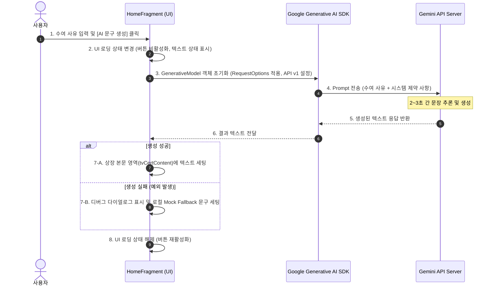

# 🤖 AI 상장 문구 자동 생성 (FR-01)

## 1. 기능 개요
사용자가 상장을 주고 싶은 지인의 이름과 상장을 수여하려는 짧은 이유(예: "매일 아침 깨워줘서 고마움")를 텍스트로 입력하면, 생성형 AI(Gemini API)를 활용하여 정중하면서도 위트 있는 고품질의 상장 본문 텍스트를 실시간으로 자동 생성하는 기능입니다.

---

## 2. 작동 흐름 (Sequence Diagram)



---

## 3. 핵심 소스코드 구현 (`HomeFragment.kt`)

### 3.1 `GenerativeModel` 이중 모델(Primary & Fallback) 및 API 버전 매핑
무료 티어 환경에서 특정 모델의 트래픽 폭주(503 Service Unavailable) 등으로 인한 생성 실패를 방지하기 위해, 상대적으로 안정적이고 처리 용량이 큰 **`gemini-1.5-flash`** 모델을 기본(Primary)으로 시도하고, 실패 시 최신 **`gemini-2.5-flash`** 모델을 대체(Fallback)로 재시도하는 이중화 호출 구조를 적용했습니다. 명시적으로 `v1` 엔드포인트를 호출하도록 구성해 버전 충돌을 완화합니다.

private suspend fun tryGenerateWithModel(modelName: String, reason: String): String? {
    val generativeModel = GenerativeModel(
        modelName = modelName,
        apiKey = BuildConfig.GEMINI_API_KEY,
        requestOptions = RequestOptions(
            timeout = 60.seconds,
            apiVersion = "v1"
        )
    )
    val prompt = """
        다음은 상장을 수여하려는 사유입니다: "$reason"
        이 사유를 바탕으로 정중하고 격려와 약간의 유머가 섞인 품격 있는 상장 본문(Certificate text)으로 자연스럽게 생성해줘.
        조건:
        1. 오직 상장 본문에 해당하는 2~3문장의 텍스트만 출력하고, 다른 설명이나 제목, 인사말, 기호 등은 절대 포함하지 마라.
        2. 한국어로 작성하고, 문장 끝은 "~하기에 이 상장을 수여합니다." 또는 "~하여 이 상을 드립니다." 등으로 격식 있게 맺어라.
    """.trimIndent()
    
    var lastException: Exception? = null
    var delayMs = 1000L
    for (attempt in 1..3) {
        try {
            val response = generativeModel.generateContent(prompt)
            val text = response.text?.trim()
            if (!text.isNullOrEmpty()) {
                return text
            }
        } catch (e: Exception) {
            e.printStackTrace()
            lastException = e
            
            val isNonRetryable = e is com.google.ai.client.generativeai.type.InvalidAPIKeyException ||
                                 e is com.google.ai.client.generativeai.type.PromptBlockedException ||
                                 (e.message?.contains("API key") == true)
            
            if (isNonRetryable || attempt == 3) {
                throw e
            }
        }
        // 지수 백오프(Exponential Backoff)를 이용한 대기 후 재시도
        kotlinx.coroutines.delay(delayMs)
        delayMs *= 2
    }
    if (lastException != null) {
        throw lastException
    }
    return null
}
```

### 3.2 시스템 프롬프트 제약 조건 설계
구조화된 상장 출력을 보장하기 위해 프롬프트를 세심하게 설계하여 다른 수식어나 마크다운 포맷이 섞이지 않도록 제약했습니다.

```kotlin
val prompt = """
    다음은 상장을 수여하려는 사유입니다: "$reason"
    이 사유를 바탕으로 정중하고 격려와 약간의 유머가 섞인 품격 있는 상장 본문(Certificate text)으로 자연스럽게 생성해줘.
    조건:
    1. 오직 상장 본문에 해당하는 2~3문장의 텍스트만 출력하고, 다른 설명이나 제목, 인사말, 기호 등은 절대 포함하지 마라.
    2. 한국어로 작성하고, 문장 끝은 "~하기에 이 상장을 수여합니다." 또는 "~하여 이 상을 드립니다." 등으로 격식 있게 맺어라.
""".trimIndent()
```

---

## 4. 예외 처리 및 Fallback 메커니즘
네트워크 미연결, API Key 한도 초과, 인증 에러, 서버 과부하 등 비정상 상황이 발생할 경우 사용자의 경험을 해치지 않도록 방어적인 Fallback 코드를 구현하였습니다.

1.  **이중 AI 모델 재시도**: `gemini-1.5-flash` 호출 중 에러가 발생하면 자동으로 `gemini-2.5-flash` 모델을 통해 재생성을 시도합니다.
2.  **친화적인 서버 오류 메시지**: 서버 과부하로 인한 임시 503(UNAVAILABLE) 에러 발생 시, 사용자에게 무서운 기술 스택 트레이스 다이얼로그 대신 "현재 AI 서버 트래픽이 많아 기본 문구로 대체되었습니다. 잠시 후 다시 시도해 주세요."라는 친절한 토스트 메시지를 표시합니다.
3.  **Mock 텍스트 롤백**: 두 모델 모두 정상 응답을 주지 못해 완전 실패할 경우, `getMockAwardText(reason)` 함수를 호출하여 사용자가 입력한 사유가 삽입된 정형화된 상장 본문을 로컬에서 안전하게 구성해 즉시 제공합니다.
4.  **디버그 얼럿**: 개발 및 테스트 과정의 신속한 오류 식별을 위해 일반 개발자 에러나 예측 못한 에러에 대해서만 catch 블록 내부에서 예외 메시지와 스택 트레이스를 `AlertDialog`로 상세 표출하도록 구성했습니다.

```kotlin
private fun getMockAwardText(reason: String): String {
    return "위 사람은 평소 \"$reason\" 활동을 통해 주변 사람들에게 큰 기쁨과 긍정적인 에너지를 전파하였으며, 그 헌신적인 노력이 타의 모범이 되므로 이 상장을 수여하여 칭찬하고 격려합니다."
}
```
